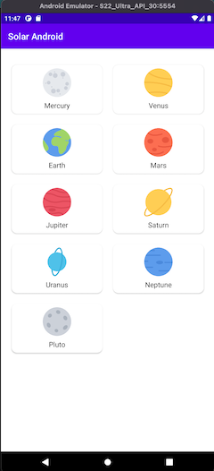

Solar Android
=================

Solar Android is a simple single activity, multiple fragments application using modern Android best practices. It is intended to be used as an updated example bootstrapping or updating other applications and to demo updated patterns and features as a proof of concept.

Introduction
--------------

Solar Android is heavily based upon Google's Android Jetpack best practices application, [sunflower](https://github.com/android/sunflower), and make minor modifications and tweaks such as Kotlin DSL, Detekt, Ktlint, and a custom editorconfig.

Getting Started
--------------

This project uses the Gradle build system. To build this project, use the `gradlew build` command or use "Import Project" in Android Studio.

There are two Gradle tasks for testing the project:
* `connectedAndroidTest` - for running Espresso on a connected device
* `test` - for running unit tests

For more resources on learning Android development, visit the [Developer Guides](https://developer.android.com/guide/) at [developer.android.com](https://developer.android.com).

Screenshots
--------------

Notable Architecture Patterns
--------------

* [Android Architecture](https://developer.android.com/topic/architecture)
* [MVVM](https://developer.android.com/topic/libraries/architecture/viewmodel)

Notable Source Patterns
--------------

Solar Android uses a source code architecture that splits packages based upon components, not features, with the intention that large features should instead be separate modules. Ideally, each module has one `Activity` and uses fragment navigation with safeArgs to move between `Fragments`.

Notable Libraries
--------------

* [Glide](https://bumptech.github.io/glide) - For image loading
* [Hilt](https://developer.android.com/training/dependency-injection/hilt-android) - For dependency injection
* [Kotlin Coroutines](https://kotlinlang.org/docs/reference/coroutines-overview.html) - For managing background threads with simplified code and reducing needs for callbacks
* [LiveData](https://developer.android.com/topic/libraries/architecture/livedata) - Build data objects that notify views when the underlying database changes
* [Navigation](https://developer.android.com/topic/libraries/architecture/navigation/) - Handle everything needed for in-app navigation
* [Room](https://developer.android.com/topic/libraries/architecture/room) - Access your app's SQLite database with in-app objects and compile-time checks
